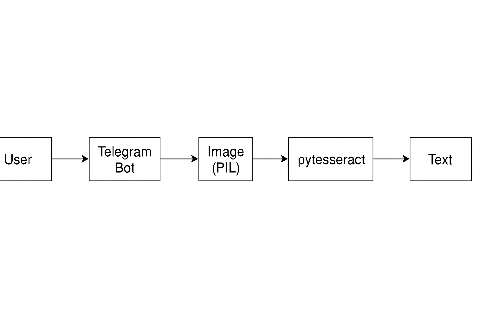
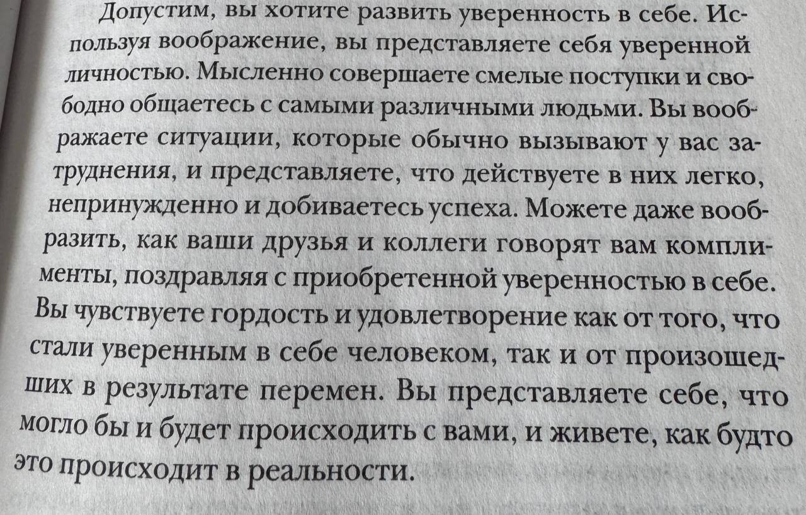
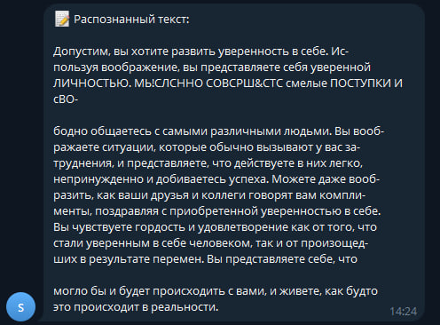

# 🤖 Telegram OCR Bot

Бот для Telegram, который распознаёт текст с изображений с помощью OCR. Поддерживает английский 🇬🇧 и русский 🇷🇺 языки. Написан на Python с использованием `aiogram`, `pytesseract` и `Pillow`.

---

## 📌 Цель проекта

Создать Telegram-бота, который принимает фото от пользователя, извлекает с него текст и возвращает его обратно. Проект реализует pipeline: пользователь → бот → изображение → OCR → текст.

---

## 🧠 Стек технологий

- Язык: **Python**
- Telegram API: **Aiogram**
- OCR: **Tesseract OCR** (`pytesseract`)
- Работа с изображениями: **Pillow**
- Диаграммы: **draw.io**, **Markdown**

---

## 🗺 Архитектура проекта

### 🔄 Блок-схема взаимодействия

<p align="center">
  
</p>

---

## 🛠 Установка и запуск

1. Установи зависимости:

```bash
pip install -r requirements.txt
```


